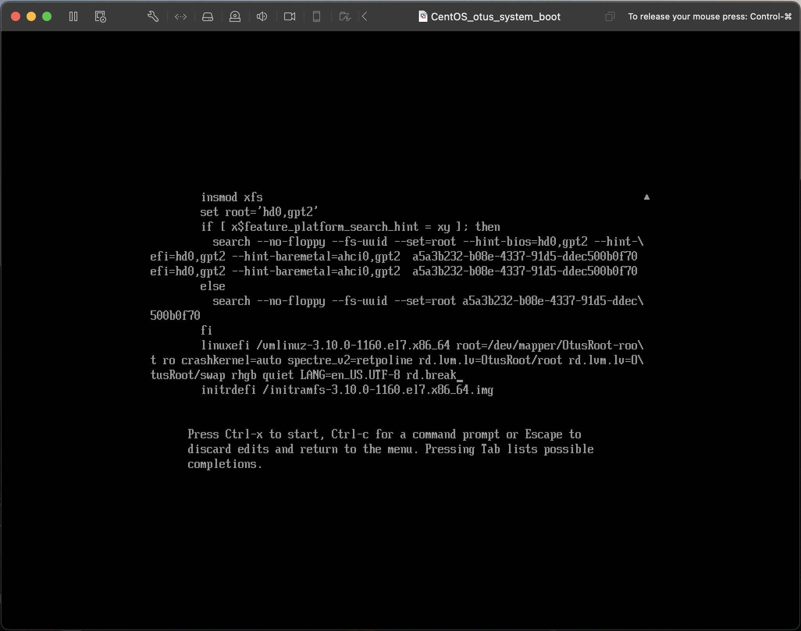

# Work log

## Preparation

First of all, you need to install system to VM. In my case i used VMware Fusion utility & Centos7 minimal ISO <br>


## Task: Passwordless entry; three ways

### Fist way

1. After complete installation, with first boot you need to press 'e' while boot options are on the screen


2. Add to load paraments `init=/bin/sh`


3. Press `ctrl+x` to load the system


4. Mount root filesystem with read-write permissions with `mount -o remount rw /` command

Result: now you can manage the system files without system authentication

### Second way

1. After system boot you need to edit boot options like in First way
2. Add `rd.break` options



3. Press `ctrl+x` to load system & enter to emergency mode


4. Now all you need to do is remount sysroot filesystem with read and write permissions and change root password


5. Reboot and login into the system with new password


### Third way

1. Like in first two ways edit boot options with `e` button
2. Add line `init=/sysroot/bin/sh`


4. Press `ctrl+x` to load system


## Install system with LVM & rename VG

1. Let's install Centos7 one more time!


2. Login into system, and see what `vgs` state now
```bash
ssh root@192.168.155.208
The authenticity of host '192.168.155.208 (192.168.155.208)' can't be established.
ED25519 key fingerprint is SHA256:Yv4fCTEpK9BBaao84MLBcz1qdADHcW/3e1pyLS92TTo.
This key is not known by any other names
Are you sure you want to continue connecting (yes/no/[fingerprint])? yes
Warning: Permanently added '192.168.155.208' (ED25519) to the list of known hosts.
root@192.168.155.208's password: 
Last login: Sun May 21 13:01:58 2023
[root@localhost ~] vgs
  VG     #PV #LV #SN Attr   VSize   VFree
  centos   1   2   0 wz--n- <19,00g    0 
[root@localhost ~]# 
```
3. Let's rename volume group `vgrename centos OtusRoot`
```bash
[root@localhost ~] vgrename centos OtusRoot
Volume group "centos" successfully renamed to "OtusRoot"
```
4. Now you need to edit all files and change old name to new one in
* `/etc/fstab`
* `/etc/default/grub`
* `/boot/grub2/grub.cfg`

```bash
#
# /etc/fstab
# Created by anaconda on Sun May 21 12:53:44 2023
#
# Accessible filesystems, by reference, are maintained under '/dev/disk'
# See man pages fstab(5), findfs(8), mount(8) and/or blkid(8) for more info
#
/dev/mapper/OtusRoot-root /                       xfs     defaults        0 0
UUID=13d94a71-f015-4593-912f-b0268a45b906 /boot                   xfs     defaults        0 0
/dev/mapper/OtusRoot-swap swap                    swap    defaults        0 0
```
```bash
GRUB_TIMEOUT=5
GRUB_DISTRIBUTOR="$(sed 's, release .*$,,g' /etc/system-release)"
GRUB_DEFAULT=saved
GRUB_DISABLE_SUBMENU=true
GRUB_TERMINAL_OUTPUT="console"
GRUB_CMDLINE_LINUX="crashkernel=auto spectre_v2=retpoline rd.lvm.lv=OtusRoot/root rd.lvm.lv=OtusRoot/swap rhgb quiet"
GRUB_DISABLE_RECOVERY="true"
```

```bash

### BEGIN /etc/grub.d/10_linux ###
menuentry 'CentOS Linux (3.10.0-1160.el7.x86_64) 7 (Core)' --class centos --class gnu-linux --class gnu --class os --unrestricted $menuentry_id_option 'gnulinux-3.10.0-1160.el7.x86_64-advanced-d0292662-4e60-4db8-a3e5-5144ca98a50a' {
        load_video
        set gfxpayload=keep
        insmod gzio
        insmod part_msdos
        insmod xfs
        set root='hd0,msdos1'
        if [ x$feature_platform_search_hint = xy ]; then
          search --no-floppy --fs-uuid --set=root --hint-bios=hd0,msdos1 --hint-efi=hd0,msdos1 --hint-baremetal=ahci0,msdos1 --hint='hd0,msdos1'  13d94a71-f015-4593-912f-b0268a45b906
        else
          search --no-floppy --fs-uuid --set=root 13d94a71-f015-4593-912f-b0268a45b906
        fi
        linux16 /vmlinuz-3.10.0-1160.el7.x86_64 root=/dev/mapper/OtusRoot-root ro crashkernel=auto spectre_v2=retpoline rd.lvm.lv=OtusRoot/root rd.lvm.lv=OtusRoot/swap rhgb quiet LANG=en_US.UTF-8
        initrd16 /initramfs-3.10.0-1160.el7.x86_64.img
}
menuentry 'CentOS Linux (0-rescue-c1790261c3524540a3b90b48632edfaa) 7 (Core)' --class centos --class gnu-linux --class gnu --class os --unrestricted $menuentry_id_option 'gnulinux-0-rescue-c1790261c3524540a3b90b48632edfaa-advanced-d0292662-4e60-4db8-a3e5-5144ca98a50a' {
        load_video
        insmod gzio
        insmod part_msdos
        insmod xfs
        set root='hd0,msdos1'
        if [ x$feature_platform_search_hint = xy ]; then
          search --no-floppy --fs-uuid --set=root --hint-bios=hd0,msdos1 --hint-efi=hd0,msdos1 --hint-baremetal=ahci0,msdos1 --hint='hd0,msdos1'  13d94a71-f015-4593-912f-b0268a45b906
        else
          search --no-floppy --fs-uuid --set=root 13d94a71-f015-4593-912f-b0268a45b906
        fi
        linux16 /vmlinuz-0-rescue-c1790261c3524540a3b90b48632edfaa root=/dev/mapper/OtusRoot-root ro crashkernel=auto spectre_v2=retpoline rd.lvm.lv=OtusRoot/root rd.lvm.lv=OtusRoot/swap rhgb quiet
        initrd16 /initramfs-0-rescue-c1790261c3524540a3b90b48632edfaa.img
}

### END /etc/grub.d/10_linux ###
```

5. Recreate initrd image
```bash
mkinitrd -f -v /boot/initramfs-$(uname -r).img $(uname -r)
Executing: /usr/sbin/dracut -f -v /boot/initramfs-3.10.0-1160.el7.x86_64.img 3.10.0-1160.el7.x86_64
...
*** Including module: shutdown ***
*** Including modules done ***
*** Installing kernel module dependencies and firmware ***
*** Installing kernel module dependencies and firmware done ***
*** Resolving executable dependencies ***
*** Resolving executable dependencies done***
*** Hardlinking files ***
*** Hardlinking files done ***
*** Stripping files ***
*** Stripping files done ***
*** Generating early-microcode cpio image contents ***
*** Constructing GenuineIntel.bin ****
*** Constructing GenuineIntel.bin ****
*** Store current command line parameters ***
*** Creating image file ***
*** Creating microcode section ***
*** Created microcode section ***
*** Creating image file done ***
*** Creating initramfs image file '/boot/initramfs-3.10.0-1160.el7.x86_64.img' done ***
```
6. Reboot and check volume group now is renamed


## Task: Add module to initrd

1. Create dirictory in `modules.d`

`mkdir /usr/lib/dracut/modules.d/01test`

2. Insert installation module
```bash
cat << EOF > /usr/lib/dracut/modules.d/01test/module-setup.sh
#!/bin/bash

check() {
    return 0
}

depends() {
    return 0
}

install() {
    inst_hook cleanup 00 "${moddir}/test.sh"
}
EOF 
```

3. Insert module (shell script)
```bash
cat << EOF > /usr/lib/dracut/modules.d/01test/test.sh
#!/bin/bash

exec 0<>/dev/console 1<>/dev/console 2<>/dev/console
cat <<'msgend'
Hello! You are in dracut module!
 ___________________
< I'm dracut module >
 -------------------
   \
    \
        .--.
       |o_o |
       |:_/ |
      //   \ \
     (|     | )
    /'\_   _/`\
    \___)=(___/
msgend
sleep 10
echo " continuing...."
EOF
```
4. Rebuild initrd
`mkinitrd -f -v /boot/initramfs-$(uname -r).img $(uname -r)`
or
`dracut -f -v`
```bash
[root@localhost ~] dracut -f -v
Executing: /usr/sbin/dracut -f -v
...
*** Created microcode section ***
*** Creating image file done ***
*** Creating initramfs image file '/boot/initramfs-3.10.0-1160.el7.x86_64.img' done ***
```
5. Check what modules are in image

`lsinitrd -m /boot/initramfs-$(uname -r).img | grep test`

```bash
[root@localhost ~] lsinitrd -m /boot/initramfs-$(uname -r).img | grep test
test
```
6. Remove quiet from boot options & reboot


